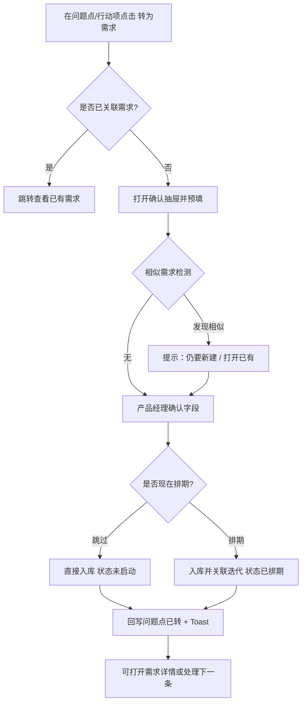

# PRD：版本管理平台 · 用户反馈模块

| 字段 | 内容 |
|---|---|
| 文档版本 | v1.1 |
| 状态 | 评审中（已确认：落地版本非必填；产品经理可直接入库） |
| 关联系统 | 项目管理（需求管理系统 / 迭代管理系统） |
| 核心目标 | 把「版本发布后的用户声音」结构化沉淀，并一键流转进需求池看板完成排期 |
| 首期产品 | Visha / Notes / Themes（可扩展；注意：产品名 Themes ≠ 下文「问题点」） |
| 数据来源 | Google Play + CMS · AI 标注（情感 / 模块 / 质量分 / 翻译） |

---

## 1. 背景与问题

当前用户反馈以**周报 HTML / CSV**形式存在，产品同学需要：

1. 在周报里读洞察与原声  
2. 人工判断哪些值得做  
3. 切到「需求池看板」手动新建需求、粘贴背景、再排期  

中间存在三处断裂：

- **版本视角缺失**：周报是时间切片，无法回答「某次发布（如 8.3.0.26）上线后用户怎么说」  
- **洞察无法闭环**：行动项停在周报文案，无法变成可排期的需求实体  
- **证据链丢失**：需求卡片看不到「多少用户、什么渠道、哪条原声」支撑决策  

因此在项目管理体系下新增**版本管理平台**，首期落地**用户反馈模块**，并与现有需求池看板打通。

---

## 2. 产品定位与信息架构

### 2.1 在项目管理中的位置

```
项目管理（首页）
├── 需求管理系统          ← 已有（需求池 / AI提效 / 周进展 / 设计）
├── 迭代管理系统          ← 已有（迭代看板 / 研测专区 / 甘特）
└── 版本管理平台（新增）
    ├── 版本总览（可选二期）
    └── 用户反馈（本期 MVP）
        ├── 总反馈（按周）
        └── 版本反馈（按发布版本）
```

首页新增第三张模块卡：

| 模块名 | 说明文案 | 角标 |
|---|---|---|
| 版本管理平台 | 按产品沉淀发布版本与用户反馈，支持洞察复盘与一键转需求 | `本周 N 条有效反馈` / `待处理洞察 M` |

侧栏同步增加「版本管理平台」入口，结构与需求/迭代系统一致。

### 2.2 核心对象

> **命名说明（避免与产品 Themes 混淆）**  
> 下文一律用 **「问题点」**，指 AI 把多条用户原声聚类后的一个具体问题，例如「下载功能异常/无法使用」。  
> **不是** 产品线里的 Themes。产品线仍称「产品」（Visha / Notes / Themes）。

层级示意（以 Visha 周报为例）：

```
产品 Product：Visha
 └─ 功能模块 Module：下载功能（176 条，27.1%）     ← 大类，偏粗
     └─ 问题点 Issue：下载功能异常/无法使用        ← 一键转需求的默认粒度
         └─ 用户原声 Voice：具体评论若干条
```

| 对象 | 定义 | 主键示例 |
|---|---|---|
| Product | 产品线（Visha / Notes / Themes…） | `Visha` |
| FeedbackWeek | 自然周反馈汇总（周一～周日） | `2026-07-20_2026-07-26` |
| ReleaseVersion | 一次对外发布的版本 | `8.3.0.26`（含全量/灰度标记） |
| Module | 功能模块大类 | 「下载功能」「本地音频」 |
| Issue（问题点） | AI/人工聚类后的具体问题 | 「下载功能异常/无法使用」 |
| Voice | 单条用户原声 | GP/CMS 原始 ID |
| ActionCandidate | 建议行动项 / 可转需求候选 | 关联某个问题点 |
| Requirement | 需求池中的需求实体 | 现有 `pool` 需求 ID |

关系：

```
Product（如 Visha）
  ├─ FeedbackWeek ── Module ── Issue（问题点）── Voice
  │                              └─ ActionCandidate ──(一键转)──► Requirement
  └─ ReleaseVersion ── Module ── Issue（问题点）── Voice
                                 └─ ActionCandidate ──(一键转)──► Requirement
```

**转需求默认挂在「问题点」上**，而不是整个「功能模块」：  
同一模块下可能有多个问题点（如「无法下载」vs「下载后无法播放」），拆开转成多条需求更利于排期；若产品经理认为应合并，可在抽屉里改名称/详情后自行描述，一期不做「多问题点合并转一条」的批量能力。

### 2.3 导航与页面地图

```
版本管理平台首页
└── 用户反馈
    ├── 产品选择（顶栏 Tab 或左侧产品切换）
    ├── [总反馈] 周列表 → 周详情报告
    └── [版本反馈] 版本列表 → 版本详情报告
         └── 任意 问题点 / 行动项 →「转为需求」抽屉 → 写入需求池
```

面包屑规范：

`项目管理 / 版本管理平台 / 用户反馈 / {产品} / {总反馈|版本反馈} / {周期或版本号}`

---

## 3. 目标用户与场景

| 角色 | 核心诉求 |
|---|---|
| 产品经理 | 快速看本周/本版本的核心差评，把 P0 问题点转成需求并排期；**可直接入库，无需二次审批** |
| 产品负责人 | 查看本产品反馈与已转入需求的进展（不拦截入库） |
| 运营 / 客服分析 | 核对渠道量、地区分布、原声证据 |
| 研发负责人 | 从版本反馈定位回归问题，关联迭代修复 |

主路径（Happy Path）：

1. 进入用户反馈 → 选产品 Visha  
2. 打开「总反馈」最新一周 / 或「版本反馈」最新全量版  
3. 在某个**问题点**上看到条数、占比、阻断/体验分级  
4. 点击「转为需求」  
5. 系统预填需求名称/详情/优先级/来源证据（落地版本可留空）  
6. 产品经理确认后直接写入需求池，状态「未启动」，可继续排期到迭代  

---

## 4. MVP 范围

### In Scope（一期）

- 版本管理平台壳 + 用户反馈模块  
- 分产品：Visha / Notes / Themes  
- 总反馈（周维度）列表 + 详情（对标现有周报结构）  
- 版本反馈（发布版本维度）列表 + 详情  
- KPI、情感占比、模块分布、地区 TOP、问题分级、用户原声、建议行动项  
- **一键转为需求**（写入需求池看板）  
- 转需求后的双向状态回写（已转 / 关联需求链接）  
- 权限：产品同学可转需求；仅本产品数据可见（可先做前端产品切换，后端按产品权限过滤）

### Out of Scope（二期+）

- 完整「版本发布流水线」管理（发版审批、灰度放量配置）  
- 自动建 Bug 单 / 对接 Jira  
- 多问题点批量合并转成一条需求  
- 反馈回复用户（GP 回复）  
- 自定义问题点人工拆合编辑器（一期只读 AI 结果，支持「标记不准」）

---

## 5. 功能需求详述

### 5.1 用户反馈 · 产品层首页

**页面目的**：进入某产品后，一眼看到「本周」和「最新版本」两条主线。

#### 布局

```
┌─────────────────────────────────────────────────────────────┐
│ 面包屑                                                       │
│ 用户反馈                              [产品切换 ▾ Visha]     │
│ 副文案：Google Play + CMS · AI 标注                          │
├─────────────────────────────────────────────────────────────┤
│ ┌──────────────┐  ┌──────────────┐  ┌──────────────┐        │
│ │ 本周有效反馈  │  │ 负面占比     │  │ 待转需求洞察 │        │
│ │ 649          │  │ 59.6%        │  │ 3            │        │
│ │ vs 上周 +4.5%│  │              │  │ P0 问题点未闭环│      │
│ └──────────────┘  └──────────────┘  └──────────────┘        │
├─────────────────────────────────────────────────────────────┤
│ [ 总反馈 ]  [ 版本反馈 ]     ← 一级 Tab（同级切换）          │
│ ─────────────────────────────────────────────────────────── │
│ （下方为对应列表，见 5.2 / 5.3）                              │
└─────────────────────────────────────────────────────────────┘
```

#### 交互

| 操作 | 行为 |
|---|---|
| 切换产品 | 顶栏 Select；切换后三个 KPI + Tab 列表整体刷新；URL 带 `?product=Visha` |
| 点击 KPI「待转需求洞察」 | 打开抽屉：列出本产品「未转需求」的 P0/P1 行动项/问题点，产品经理可直接转 |
| 切 Tab | 记忆上次 Tab；默认进入「总反馈」 |

---

### 5.2 总反馈（按周）

#### 5.2.1 周列表

**列表字段**

| 列 | 说明 | 排序默认 |
|---|---|---|
| 周期 | `2026-07-20 ~ 2026-07-26` | 倒序（最新在上） |
| 反馈总量 | 含无效 | — |
| 有效总量 | 及有效率 | — |
| 负面 / 需求 / 正面 | 数量 | 可按负面数排序 |
| 渠道拆分摘要 | 如 `GP 247 · CMS 627` | — |
| 核心问题 | 最高频模块或洞察一句话（截断） | — |
| 行动项状态 | `未处理 2 · 已转需求 1` | — |
| 操作 | 「查看周报」 | — |

**筛选**：时间范围（近 4/8/12 周）、仅看有 P0 行动项。

**交互**

- 行点击或「查看周报」→ 进入周详情  
- 空态：该产品尚无周报时，展示「等待数据同步」+ 最近同步时间  

#### 5.2.2 周详情（报告页）

结构对齐现有反馈周报，改为平台内嵌页（非独立 HTML 文件）。

**A. 页头**

- 标题：`用户反馈周报 · 2026-07-20 ~ 2026-07-26`  
- 副信息：数据来源、同步时间、产品名  
- 右侧操作：`下载原始 CSV` · `分享链接` · `返回列表`

**B. 渠道拆分条**

形如：`Visha_GP: 247（正122/负72/需7） | Visha_CMS: 627（正2/负315/需100）`

**C. 整体概览 Card**

1. KPI：反馈总量 / 有效总量（可 hover 看无效数）  
2. 情感分布：堆叠条 + 图例（正/负/需/中）+ 脚注「占比基于有效反馈」  
3. AI 洞察文案（可折叠）  
4. 版本监控摘要（本周涉及的主版本及负面/需求量）— 点击版本号可跳转「版本反馈」详情  

**D. 功能模块分布**

横向条：模块名 · 条数 · 占比 · 典型子问题描述。  
点击模块名 → 锚点滚动到「用户原声」对应问题卡，并高亮。

**E. 地区分布 TOP5**

地区/语言 + 数量。支持「查看全部」展开。

**F. 用户原声区（二级 Tab）**

| Tab | 内容 |
|---|---|
| 问题反馈 | 默认；按严重度：阻断性 / 体验 / 其他 |
| 分版本监控 | 按本周出现的版本再拆问题点（桥接到版本视角） |
| 用户好评 | 正面原声，无「转需求」，可「收藏到亮点」二期 |

**问题卡结构**

```
┌─ 下载功能（176 条，27.1%）                    [转为需求] ─┐
│  严重度：体验问题 · 情感：负面                              │
│  问题点：下载功能异常/无法使用                              │
│  💡 分析：用户反馈下载失败、按钮不显示…                     │
│  流转状态：未转需求 / 已转 → REQ-1024（进行中）             │
│  ─ 用户原声（默认展示 Top 3，可展开更多） ─                 │
│  [GP] 印尼语 · 8.3.0.26 · Infinix-X6525 · 1分               │
│  中文译文…                                                   │
│  原文… · AI摘要…                                            │
└─────────────────────────────────────────────────────────────┘
```

> 「转为需求」默认作用在当前**问题点**（上例即「下载功能异常/无法使用」），不是整个「下载功能」模块，也不是产品 Themes。

**G. 建议行动项**

列表项：`P0/P1` 标签 + 文案 + 「转为需求」+ 状态。  
与问题卡共用同一转需求能力（见第 6 章）。

---

### 5.3 版本反馈（按发布版本）

#### 5.3.1 版本列表

**列表字段**

| 列 | 说明 |
|---|---|
| 版本号 | `8.3.0.26` |
| 版本类型 | 全量 / 灰度 Badge |
| 首次出现日期 / 观测窗口 | 如发布后累计 14 天 or「持续监测至下一全量」 |
| 关联反馈量 | 有效负面+需求为主，可切换看总量 |
| 负面占比 | — |
| Top 问题 | 最高频问题点 |
| vs 上一版本 | 有效负面环比 ↑↓ |
| 行动项状态 | 同周报 |
| 操作 | 查看 |

**筛选**：版本类型、时间、仅看「负面占比恶化」。

**与「总反馈」差异（产品规则）**

| 维度 | 总反馈 | 版本反馈 |
|---|---|---|
| 切片 | 自然周 | 发布版本号 |
| 用途 | 例行周复盘、跨版本噪声 | 发版质量与回归问题 |
| 原声归属 | 落入该周的全部反馈 | 仅 `app_version = 该版本` |
| 环比 | vs 上周 | vs 上一全量版（或指定对比版） |

#### 5.3.2 版本详情

复用周详情的模块骨架（KPI / 情感 / 模块 / 地区 / 原声 / 行动项），差异点：

1. 页头展示版本 Badge、发布说明（可链到迭代管理系统中的落地版本字段）  
2. 增加「观测窗口」选择：`发布后 7 天 / 14 天 / 全部累计`（切换后图表与列表重算）  
3. 「分版本监控」Tab 隐藏（已在版本上下文）  
4. 增加「同版本跨周趋势」迷你图：该版本在各周的负面量变化  
5. 若该版本已有转出的需求，页头展示「已关联 N 条需求」可下钻  

---

## 6. 核心流程：一键转为需求（详细交互）

### 6.1 入口（必须「一键可达」，可二次确认）

以下位置均提供主按钮 **「转为需求」**（产品经理可直接操作，无需负责人审批）：

1. 问题点卡片右上角  
2. 建议行动项行尾  
3. 产品首页「待转需求洞察」抽屉内  

按钮态：

| 状态 | 展示 |
|---|---|
| 未转 | 主色按钮「转为需求」 |
| 转需求处理中 | Loading，防重复点击 |
| 已转 | 幽灵按钮「查看需求」+ 文案「已转入需求池」 |
| 无权限 | Disabled + Tooltip「仅本产品产品经理可转」 |

### 6.2 转为需求抽屉（非跳空白表单）

点击后从右侧滑出 **「确认转入需求池」** 抽屉（沿用现有 detail-drawer 交互范式）。

#### 预填规则（自动）

| 需求池字段 | 预填来源 |
|---|---|
| 需求名称 | `{模块}：{问题点名}`，如「下载功能：下载功能异常/无法使用」；可编辑，限 60 字 |
| 需求详情 | 模板拼接（见下） |
| 所属产品 | 当前产品，锁定不可改（防止转错产品线） |
| 产品负责人 | 默认该产品 Owner，可改 |
| 进展状态 | 固定 `未启动` |
| 优先级 | 行动项 P0→P0，P1→P1；问题点无行动项时：阻断性默认 P0，体验 P1，其他 P2；可改 |
| 落地类型 | 默认 `敏捷迭代`；若问题点明确属系统版本可选手动改 `TOS版本` |
| 落地版本 | **非必填**；默认空，placeholder「排期时填写」；转需求场景不校验必填，保存后仍进池 |
| 是否价值点 | 默认「否」 |
| 是否需要数据分析 | 默认「否」；负面量 ≥ 阈值阈值时可默认「是」 |
| 需求提出日期 | 今天 |
| 目标交付月 | 默认下月，可改 |
| 相关附件 | 自动挂「反馈证据包」：周报/版本链接 + 可选 CSV 片段；展示为系统附件，不可删标题但可追加 |

**需求详情模板（自动生成，可编辑）：**

```markdown
## 来源
- 类型：{总反馈周报 | 版本反馈}
- 范围：{周期 or 版本号}
- 渠道：GP / CMS
- 问题点：{问题点名}（{条数} 条，占有效反馈 {占比}%）
- 严重度：{阻断性|体验|其他}
- 情感：{负面|需求|…}

## 问题分析
{AI issue-analysis 原文}

## 代表性用户原声（最多 5 条）
1. [{渠道}] {地区/语言} · {版本} · {机型} · {评分}
   {中文译文}
   摘要：{AI summary}

## 建议动作
{对应行动项文案，若有}

## 证据链接
- 反馈报告：{deep link}
- 原始数据：{csv 下载或内链}
```

#### 抽屉交互步骤

```
[1 确认内容] → [2 可选排期] → [完成]
```

**步骤 1 · 确认内容**

- 展示预填表单（字段布局对齐 `pool.html` 新建需求）  
- 顶部 Info 条：`将创建 1 条需求到「需求池看板」，来源可回溯`  
- 勾选项（默认勾选）：  
  - `将本问题点标记为已转需求`（回写反馈侧状态）  
  - `在需求详情中保留用户原声证据`  
- 次要操作：`仅保存草稿到反馈侧`（不进需求池，二期可做；一期可不提供）

**步骤 2 · 可选排期（可跳过）**

- 文案：`可先进入需求池，稍后再排期；也可现在指定目标迭代`  
- 字段：目标迭代（拉取迭代管理系统迭代列表，按产品过滤）、目标交付月（若上一步已填则同步）  
- 按钮：`跳过，仅入库` | `确认并排期`  
  - 「仅入库」→ 需求状态保持「未启动」  
  - 「确认并排期」→ 写入迭代关联，状态改为「已排期」（与现有池内状态机一致）

**完成态**

- Toast：`已转入需求池`  
- 抽屉内展示成功结果卡：需求名称、ID、状态 + 双按钮：  
  - `打开需求详情`（拉起需求池详情抽屉或跳转 `pool.html` 并 deep-link）  
  - `继续处理下一条`（关闭并定位下一条未转 P0）  
- 原问题卡按钮变为「查看需求」

### 6.3 幂等与冲突

| 场景 | 策略 |
|---|---|
| 同一问题点再次点击 | 不新建；提示已关联 REQ-xxx，提供「追加原声到已有需求」二期；一期仅跳转查看 |
| 相似问题点已存在需求（同产品、标题相似度高） | 抽屉顶部 Warning：`需求池可能已有相似需求「xxx」`，操作：`仍要新建` / `打开已有需求` |
| 网络失败 | 按钮恢复，Toast 失败原因；本地保留已编辑文案避免丢失 |
| 无有效原声的问题点 | 允许转，但详情模板中原声区写「暂无抽样原声」 |

### 6.4 回写与双向链接

反馈侧问题点 / 行动项增加字段：

- `requirementId`  
- `requirementStatus`（只读镜像，定时或事件同步）  
- `convertedAt` / `convertedBy`  

需求侧增加来源标记：

- `sourceType = user_feedback`  
- `sourceRef = { weekId | versionId + issueId }`  
- 列表可用小标签「反馈」筛选（一期可在详情中展示来源即可）

---

## 7. 数据指标定义

### 7.1 统计口径

| 指标 | 定义 |
|---|---|
| 反馈总量 | 同步期内全部原始条数 |
| 无效反馈 | AI 质量分过低 / 乱码 / 测试话术等，从占比分母中剔除 |
| 有效总量 | 总量 − 无效 |
| 情感占比 | 各情感 / 有效总量 |
| 模块占比 | 模块条数 / 有效总量（一条反馈单模块归属，一期不做多标签） |
| 版本反馈量 | `app_version` 精确匹配该发布号的有效反馈 |
| 待转需求洞察 | 状态=未转 且（优先级∈{P0,P1} 或 严重度=阻断性）的问题点/行动项数 |

### 7.2 展示精度

- 百分比保留 1 位小数  
- 环比：`(本期-上期)/上期`，上期为 0 时显示 `—`  
- KPI 数字用千分位  

---

## 8. 权限与合规

| 能力 | 产品经理 | 产品负责人 | 研发 | 访客 |
|---|---|---|---|---|
| 查看本产品反馈 | ✓ | ✓ | ✓ | 按授权 |
| 下载含联系方式的 CSV | ✓ | ✓ | ✗ | ✗ |
| 转为需求 | ✓（直接入库，无需审批） | ✓ | ✗ | ✗ |
| 修改已转关联 | ✓ | ✓ | ✗ | ✗ |

合规提示（页顶常驻 Info，可关闭当次）：

> 内部资料 · 含用户反馈内容（含联系方式）· 限企业内网传阅。

原声详情默认脱敏联系方式；仅「下载 CSV」权限角色可见完整字段。

---

## 9. 关键与关键交互细节

### 9.1 全局

- 沿用现有项目管理视觉：顶栏面包屑、侧栏、Card、Primary/Secondary 按钮、Drawer  
- 主色操作仅用于「转为需求」「保存」等高价值动作  
- 长报告页：问题标题 sticky（对标现有周报 sticky header）  
- 深链：支持 URL  
  - `/version/feedback?product=Visha&tab=week&week=2026-07-20_2026-07-26&theme=download`  
  - `/version/feedback?product=Visha&tab=version&ver=8.3.0.26`  

### 9.2 空态 / 加载 / 错误

| 状态 | 表现 |
|---|---|
| 首次加载 | 骨架屏：KPI 三块 + 列表行 |
| 报告生成中 | 详情页中间态「本周报告生成中，预计 xx:xx 完成」 |
| 无数据 | 插画 +「该周期暂无反馈」 |
| 部分模块失败 | 模块级 Error，可「重试」，不影响其他模块 |

### 9.3 键盘与效率

- 抽屉内 `Cmd/Ctrl + Enter` 提交  
- 列表支持 `j/k` 上下（可选增强）  

### 9.4 通知（一期轻量）

转需求成功后：

- 站内通知产品负责人（若操作者≠负责人）  
- 需求池「新建」动态可看到来源为反馈  

---

## 10. 与现有系统的集成点

```
用户反馈 问题点
    │ 转为需求 API（产品经理直接入库）
    ▼
需求池看板（pool）
    │ 排期 / 状态流转（已有）
    ▼
迭代管理系统（iterations / gantt / rd-workspace）
```

**改造点（需求池侧，小改）**

1. 新建需求接口支持 `sourceType/sourceRef`；**转需求场景下「落地版本」非必填**  
2. 需求详情增加「反馈来源」只读区块（链接回报告）  
3. 列表增加来源筛选「用户反馈」（可二期）  

**版本管理侧不重复造需求状态机**，只镜像展示关键状态。

---

## 11. 非功能需求

| 项 | 要求 |
|---|---|
| 性能 | 周/版本列表 P95 < 1s；详情首屏 < 2s（原声分页或虚拟列表，默认每问题点 Top3） |
| 同步 | 反馈数据 T+1 或准实时；页面展示「数据截至」时间 |
| 审计 | 转需求操作写审计日志（who/when/from→to） |
| 导出 | CSV 与现网字段对齐（见现有周报附件表头） |

---

## 12. 验收标准（MVP）

1. 首页可进入版本管理平台 → 用户反馈，并可切换 Visha/Notes/Themes  
2. 总反馈列表展示近 N 周核心指标，点进详情可见 KPI/情感/模块/地区/原声/行动项  
3. 版本反馈列表可按版本进入详情，且原声均属于该版本号  
4. 在问题点或行动项上点「转为需求」，抽屉预填正确，落地版本可留空；产品经理确认后需求池新增一条，`状态=未启动`，详情含证据模板  
5. 再次进入该问题点，展示「已转」及需求链接，不可重复创建  
6. 从需求详情可跳回对应周报/版本报告问题点锚点  
7. 无权限用户看不到转需求按钮或按钮禁用  
8. 含联系方式的下载受权限控制  

---

## 13. 里程碑建议

| 阶段 | 交付 | 周期建议 |
|---|---|---|
| M1 | 信息架构 + 静态 Demo（对齐现有 HTML demo 风格） | 1 周 |
| M2 | 总反馈列表/详情只读 + 真实数据接入 | 2 周 |
| M3 | 版本反馈列表/详情 + 环比 | 1.5 周 |
| M4 | 一键转需求打通需求池 + 回写 | 1.5 周 |
| M5 | 权限 / 审计 / 打磨与验收 | 1 周 |

---

## 14. 已确认决策 & 剩余开放问题

### 已确认（v1.1）

| 决策点 | 结论 |
|---|---|
| 落地版本 | 转需求时**非必填**，排期时再补 |
| 入库权限 | **产品经理直接入库**，无需负责人二次审批 |
| 转需求粒度 | 默认挂在 **问题点**（AI 聚类的具体问题，如「下载功能异常/无法使用」），不是功能模块大类，也不是产品 Themes |
| 跨产品转 | 一期禁止；所属产品锁定为当前反馈所属产品 |

### 仍待拍板

1. **灰度版归属**：灰度与全量同号段时，版本反馈是否拆成两条列表记录？  
2. **观测窗口默认值**：版本反馈默认「发布后 14 天」还是「累计至下一全量」？  

---

## 附录 A · 关键流程图（转需求）



## 附录 B · 关键线框优先级

实现 Demo / 设计时建议优先高保真这 4 屏：

1. 用户反馈 · 产品首页（KPI + 双 Tab 列表）  
2. 总反馈 · 周详情（含问题点卡「转为需求」）  
3. 版本反馈 · 版本详情  
4. 转为需求抽屉（步骤 1+2 + 成功态）  

---

*本文档对齐现有 `management_demo` 中需求池字段与反馈周报数据结构，可作为设计与前端 Demo 的直接输入。*
